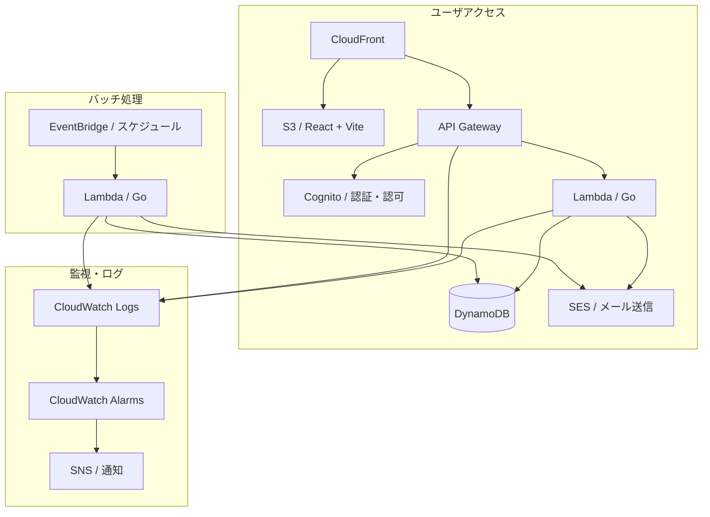

# アーキテクチャ設計

## システム構成図

## 技術スタック
| レイヤー | 技術 |
|---------|------|
| Webサイト(今回は開発対象外) | Astro |
| 予約管理アプリ | React + Vite |
| 共有コンポーネント | React（monorepo内パッケージ） |
| バックエンド | Go + Lambda |
| データベース | DynamoDB |
| 認証 | Cognito |
| メール送信 | SES |
| バッチ処理 | EventBridge + Lambda |
| 監視 | CloudWatch |
| IaC | Terraform |
| CI/CD | GitHub Actions |

## 環境構成
| 環境 | 用途 | AWSアカウント |
|------|------|-------------|
| dev | 開発・検証 | xxx |
| prod | 本番 | xxx |