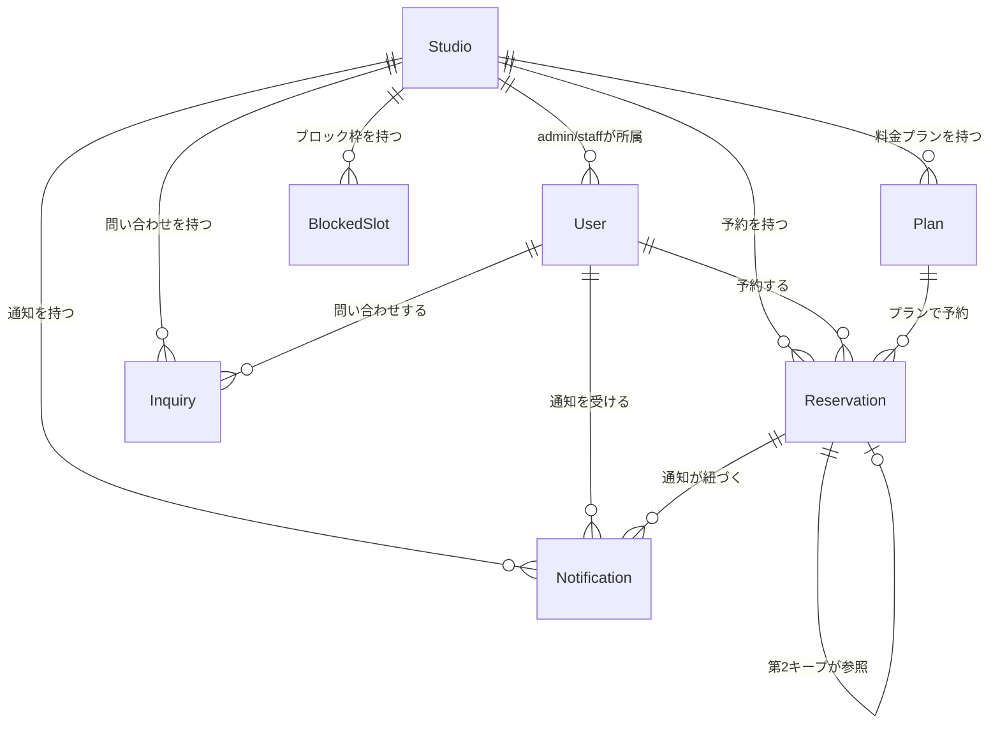

# データモデル定義

## エンティティ一覧

- User (スタジオ利用者、スタジオ管理者、スタジオスタッフ)
- Studio (スタジオ)
- Reservation (予約)
- Plan (料金プラン)
- BlockedSlot (予約不可枠)
- Inquiry (問い合わせ)
- Notification (通知)

## エンティティ定義

### User
| フィールド | 型 | 必須 | 説明 |
|------------|---|------|------|
| studio_id | string | - | 所属スタジオID(admin/staffのみ) |
| user_id | string(UUID) | ○ | ユーザーID（主キー） |
| name | string | ○ | 名前 |
| email | string | ○ | メールアドレス（ユニーク） |
| phone_number | string | ○ | 電話番号 |
| company_name | string | - | 会社名 |
| address | string | ○ | 住所 |
| role | enum | ○ | customer or admin or staff |
| created_at | string (ISO8601) | ○ | 登録日時 |
| updated_at | string (ISO8601) | ○ | 更新日時 |

### Studio
| フィールド | 型 | 必須 | 説明 |
|------------|---|------|------|
| studio_id | string | ○ | スタジオID |
| studio_name | string | ○ | スタジオ名 |
| studio_address | string | ○ | スタジオ住所 |
| phone_number | string | ○ | 電話番号 |
| email | string | ○ | メールアドレス |
| business_hours_start | string (HH:MM) | ○ | 営業開始時刻 |
| business_hours_end | string (HH:MM) | ○ | 営業終了時刻 |
| regular_holidays | list<string> | - | 定休日（例: ["sunday"]） |
| tentative_expiry_days | number | ○ | 仮予約の有効期限（利用日の何日前か） |
| cancellation_policy | string | - | キャンセルポリシーの説明 |
| is_active | boolean | ○ | スタジオの有効/無効 |
| created_at | string (ISO8601) | ○ | 作成日時 |
| updated_at | string (ISO8601) | ○ | 更新日時 |

### Reservation
| フィールド | 型 | 必須 | 説明 |
|------------|---|------|------|
| studio_id | string | ○ | スタジオID |
| reservation_id | string(UUID) | ○ | 予約ID |
| user_id | string | - | 予約者のユーザID（ゲスト予約の場合はnull） |
| is_guest | boolean | ○ | ゲスト予約フラグ（デフォルト: false、2026-04-16追加） |
| guest_name | string | - | ゲスト名（ゲスト予約の場合のみ、2026-04-16追加） |
| guest_email | string | - | ゲストメールアドレス（ゲスト予約の場合のみ、2026-04-16追加） |
| guest_phone | string | - | ゲスト電話番号（ゲスト予約の場合のみ、2026-04-16追加） |
| guest_company | string | - | ゲスト会社名（ゲスト予約の場合、オプショナル、2026-04-16追加） |
| guest_token | string(UUID) | - | 予約確認用トークン（ゲスト予約の場合のみ、UUID v4形式、2026-04-16追加） |
| reservation_type | enum | ○ | regular / tentative / location_scout / second_keep |
| status | enum | ○ | pending / tentative / confirmed / waitlisted / scheduled / cancelled / expired / completed |
| plan_id | string | ○ | 料金プランID |
| date | string (YYYY-MM-DD) | ○ | 利用日 |
| start_time | string (HH:MM) | ○ | 開始時刻 |
| end_time | string (HH:MM) | ○ | 終了時刻 |
| note | string | - | 備考 |
| cancelled_by | enum | - | customer / owner（キャンセル時のみ） |
| cancelled_at | string (ISO8601) | - | キャンセル日時 |
| promoted_from | enum | - | tentative / waitlisted（昇格元の記録） |
| promoted_at | string (ISO8601) | - | 昇格日時 |
| linked_reservation_id | string | - | 第2キープ時の第1候補予約ID |
| created_at | string (ISO8601) | ○ | 作成日時 |
| updated_at | string (ISO8601) | ○ | 更新日時 |
| needs_protection | BOOLEAN | ○ | 養生の有無 |
| number_of_people | number | ○ | 撮影人数 |
| equipment_insurance | BOOLEAN| ○ | 機材保険の有無 |
| options | list<string> | - | オプション(複数選択化)(例: 6人以上のワークショップ、ラメなどの小道具) |
| shooting_type | list<string> | ○ | 撮影内容（スチール、ムービー、楽器演奏など） |
| shooting_details | string | ○ | 撮影の詳細説明 |
| photographer_name | string | ○ | カメラマン氏名|

### Plan
| フィールド | 型 | 必須 | 説明 |
|------------|---|------|------|
| studio_id | string | ○ | スタジオID |
| plan_id | string | ○ | 料金プランID |
| plan_name | string | ○ | 料金プラン名 |
| description | string | - | プランの説明 |
| price | number | ○ | 料金（税抜） |
| tax_rate | number | ○ | 税率（例: 0.10） |
| is_active | boolean | ○ | 有効/無効（削除せず非表示にする） |
| display_order | number | - | 予約フォームでの表示順 |
| created_at | string (ISO8601) | ○ | 作成日時 |
| updated_at | string (ISO8601) | ○ | 更新日時 |

### BlockedSlot
| フィールド | 型 | 必須 | 説明 |
|------------|---|------|------|
| studio_id | string | ○ | スタジオID |
| blocked_slot_id | string(UUID) | ○ | ブロック枠ID |
| date | string (YYYY-MM-DD) | ○ | 利用日 |
| is_all_day | boolean | ○ | 終日ブロックかどうか |
| start_time | string (HH:MM) | - | 開始時刻（is_all_day=falseの場合必須） |
| end_time | string (HH:MM) | - | 終了時刻（is_all_day=falseの場合必須） |
| reason | string | ○ | 理由 |
| created_at | string (ISO8601) | ○ | 作成日時 |
| updated_at | string (ISO8601) | ○ | 更新日時 |

### Inquiry
| フィールド | 型 | 必須 | 説明 |
|------------|---|------|------|
| studio_id | string | ○ | スタジオID |
| inquiry_id | string | ○ | 問い合わせID |
| user_id | string | ○ | 問い合わせ者のユーザID |
| inquiry_title | string | ○ | 質問の題名 |
| inquiry_detail | string | ○ | 質問の内容 |
| inquiry_status | enum | ○ | open / replied / closed |
| reply_detail | string | - | 回答内容（回答時に記入） |
| replied_at | string (ISO8601) | - | 回答日時 |
| created_at | string (ISO8601) | ○ | 作成日時 |
| updated_at | string (ISO8601) | ○ | 更新日時 |

### Notification
| フィールド | 型 | 必須 | 説明 |
|------------|---|------|------|
| studio_id | string | ○ | スタジオID |
| notification_id | string(UUID) | ○ | 通知ID |
| user_id | string | ○ | 通知先のユーザID |
| reservation_id | string | - | 関連する予約ID |
| notification_type | enum | ○ | reminder / tentative_expiry / promotion / cancellation |
| notification_detail | string | ○ | 通知内容 |
| status | enum | ○ | pending / sent / failed |
| scheduled_at | string (ISO8601) | ○ | 送信予定日時 |
| sent_at | string (ISO8601) | - | 実際の送信日時 |
| created_at | string (ISO8601) | ○ | 作成日時 |
| updated_at | string (ISO8601) | ○ | 更新日時 |

## エンティティ間の関係

## アクセスパターン一覧

### スタジオ利用者

| # | ユースケース | 操作 | エンティティ | 条件 | R/W | 頻度 |
|---|------------|------|-------------|------|-----|------|
| AP-01 | UC-101 | ユーザを作成する | User | - | W | 低 |
| AP-02 | UC-101 | メールアドレスの重複チェック | User | email | R | 低 |
| AP-03 | UC-102 | 指定月の予約一覧を取得 | Reservation | studio_id + date範囲 | R | 高 |
| AP-04 | UC-102 | 指定月のブロック枠一覧を取得 | BlockedSlot | studio_id + date範囲 | R | 高 |
| AP-05 | UC-103 | 同一時間帯の予約存在チェック | Reservation | studio_id + date + 時間帯 | R | 高 |
| AP-06 | UC-103 | ブロック枠の存在チェック | BlockedSlot | studio_id + date | R | 高 |
| AP-07 | UC-103 | 予約を作成する | Reservation | - | W | 高 |
| AP-50 | UC-103 | 有効なプラン一覧を取得 | Plan | studio_id + is_active=true | R | 高 |
| AP-08 | UC-103 | 通知を作成する | Notification | - | W | 高 |
| AP-09 | UC-104 | 自分の予約一覧を取得 | Reservation | user_id | R | 中 |
| AP-10 | UC-104 | 予約IDで1件取得 | Reservation | reservation_id | R | 中 |
| AP-11 | UC-105 | 予約ステータスを更新（cancelled） | Reservation | reservation_id | W | 低 |
| AP-12 | UC-105 | キャンセル通知を作成 | Notification | - | W | 低 |
| AP-13 | UC-106 | 予約ステータスを更新（tentative→pending） | Reservation | reservation_id | W | 低 |
| AP-14 | UC-107 | 問い合わせを作成する | Inquiry | - | W | 低 |
| AP-15 | UC-107 | 自分の問い合わせ一覧を取得 | Inquiry | user_id | R | 低 |

### スタジオ管理者

| # | ユースケース | 操作 | エンティティ | 条件 | R/W | 頻度 |
|---|------------|------|-------------|------|-----|------|
| AP-16 | UC-201 | スタッフユーザを作成する | User | - | W | 低 |
| AP-17 | UC-202 | 予約を作成する（管理者側） | Reservation | - | W | 中 |
| AP-18 | UC-203 | pending予約一覧を取得 | Reservation | studio_id + status=pending | R | 高 |
| AP-19 | UC-203 | 予約ステータスを更新（承認） | Reservation | reservation_id | W | 高 |
| AP-20 | UC-203 | 承認通知を作成 | Notification | - | W | 高 |
| AP-21 | UC-204 | 予約ステータスを更新（cancelled） | Reservation | reservation_id | W | 低 |
| AP-22 | UC-204 | 拒否通知を作成 | Notification | - | W | 低 |
| AP-23 | UC-205 | 仮予約ステータスを更新（confirmed） | Reservation | reservation_id | W | 低 |
| AP-24 | UC-206 | 日付範囲で予約一覧を取得 | Reservation | studio_id + date範囲 | R | 高 |
| AP-25 | UC-207 | 予約IDで詳細取得 | Reservation | reservation_id | R | 高 |
| AP-26 | UC-207 | 予約者情報を取得 | User | user_id | R | 高 |
| AP-27 | UC-208 | 予約ステータスを更新（cancelled） | Reservation | reservation_id | W | 低 |
| AP-28 | UC-209 | 予約内容を更新 | Reservation | reservation_id | W | 低 |
| AP-29 | UC-210 | ブロック枠を作成する | BlockedSlot | - | W | 低 |
| AP-30 | UC-210 | ブロック枠一覧を取得 | BlockedSlot | studio_id + date範囲 | R | 低 |
| AP-31 | UC-210 | ブロック枠を削除する | BlockedSlot | blocked_slot_id | W | 低 |
| AP-32 | UC-211 | プラン一覧を取得 | Plan | studio_id | R | 低 |
| AP-33 | UC-211 | プランを作成/更新/無効化する | Plan | plan_id | W | 低 |
| AP-34 | UC-212 | 通知対象ユーザ一覧を取得 | User | studio_idで過去予約があるユーザ | R | 低 |
| AP-35 | UC-212 | 告知通知を一括作成 | Notification | - | W | 低 |
| AP-36 | UC-213 | 未回答の問い合わせ一覧を取得 | Inquiry | studio_id + status=open | R | 低 |
| AP-37 | UC-213 | 問い合わせに回答する | Inquiry | inquiry_id | W | 低 |

### スタジオスタッフ

| # | ユースケース | 操作 | エンティティ | 条件 | R/W | 頻度 |
|---|------------|------|-------------|------|-----|------|
| AP-38 | UC-301 | 日付範囲で予約一覧を取得 | Reservation | studio_id + date範囲 | R | 中 |
| AP-39 | UC-302 | 予約IDで詳細取得 | Reservation | reservation_id | R | 中 |

### システム

| # | ユースケース | 操作 | エンティティ | 条件 | R/W | 頻度 |
|---|------------|------|-------------|------|-----|------|
| AP-40 | UC-902 | 期限3日前の仮予約を取得 | Reservation | status=tentative + 期限日 | R | 低（日次バッチ） |
| AP-41 | UC-902 | 期限通知を作成 | Notification | - | W | 低 |
| AP-42 | UC-903 | 第2キープを取得 | Reservation | linked_reservation_id | R | 低 |
| AP-43 | UC-903 | 第2キープのステータスを更新 | Reservation | reservation_id | W | 低 |
| AP-44 | UC-904 | 翌日の予約一覧を取得 | Reservation | studio_id + date=明日 + status=confirmed | R | 低（日次バッチ） |
| AP-45 | UC-904 | リマインド通知を作成 | Notification | - | W | 低 |
| AP-46 | UC-905 | 利用日経過の予約を取得 | Reservation | date < 今日 + status=confirmed/scheduled | R | 低（日次バッチ） |
| AP-47 | UC-905 | ステータスをcompletedに更新 | Reservation | reservation_id | W | 低 |
| AP-48 | UC-906 | 期限切れの仮予約を取得 | Reservation | status=tentative + 期限日 < 今日 | R | 低（日次バッチ） |
| AP-49 | UC-906 | ステータスをexpiredに更新 | Reservation | reservation_id | W | 低 |

## その他
- calendarエンティティはreservationエンティティと内容が被るため、データの二重管理になり同期問題などが発生する。  
    reservationへのアクセスパターンとして定義すればOK。
- UC-901(予約カレンダーを最新の状態にする)は、AP-03/24などで都度最新データを取得することで実現する（イベント駆動）