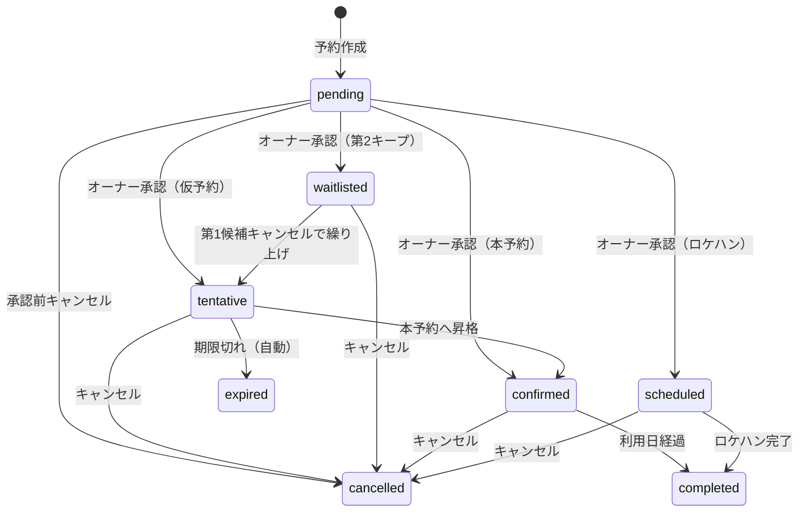

# スタジオゼブラ 予約管理アプリケーション要件

## 概要
スタジオゼブラの利用予約を管理するWebアプリケーション。
将来的に他スタジオ向けSaaSへの展開を見据える。

## ユーザと役割
| ユーザー | 説明 |
|----------|----------|
| スタジオ利用者 | スタジオを予約し、利用する顧客 |
| スタジオ管理者 | 予約の確認・承認・管理を行うスタジオ運営者 |
| スタジオスタッフ | スタジオの運営を支援するスタッフ |

## ユースケース

### スタジオ利用者（UC-1xx）

#### UC-101: アプリケーションへのユーザ登録をする
#### UC-102: 予約状況を確認する（カレンダーから確認）
#### UC-103: 予約を作成する
#### UC-104: 予約内容を確認する
#### UC-105: 予約をキャンセルする
#### UC-106: 仮予約を本予約に切り替える
#### UC-107: 問い合わせをする
  アプリ内機能として実装する

### スタジオ管理者（UC-2xx）

#### UC-201: スタジオスタッフのユーザ登録をする
#### UC-202: 予約を作成する
#### UC-203: 予約を承認する
#### UC-204: 予約を拒否する
#### UC-205: 仮予約を本予約に切り替える
#### UC-206: 予約一覧を確認する（日別・週別・月別）
#### UC-207: 予約詳細を確認する
#### UC-208: 予約をキャンセルする（オーナー側から）
#### UC-209: 予約内容を編集する
#### UC-210: ブロック枠を設定する（休業日、プライベート利用など）
#### UC-211: スタジオ利用料金などを管理する（追加・編集・削除）
#### UC-212: リピーター向けに告知などをする
#### UC-213: 問い合わせがあったら回答する
  アプリ内機能として実装する

### スタジオスタッフ（UC-3xx）

#### UC-301: 予約一覧を確認する（日別・週別・月別）
#### UC-302: 予約詳細を確認する

### システム（UC-9xx）

#### UC-901: 予約カレンダーを最新の状態にする
#### UC-902: 仮予約の期限が迫っていることを3日前に通知する
#### UC-903: 第2キープの繰り上げを処理する
#### UC-904: リマインドメールを送信する
#### UC-905: 予約完了後にステータスを更新する
#### UC-906: 期限切れの仮予約を自動でexpiredに更新する

### 予約種別ごとのルール
| 種別 | 説明 | 確定条件 | 有効期限 | キャンセル料 |
|------|------|---------|----------|------------|
| 本予約 | 利用日が確定した予約 | 同一時間帯に確定済みの予約が存在しない場合 | なし | キャンセルポリシーにのっとる |
| 仮予約 | 利用日を仮押さえする予約 | 同一時間帯に確定済みの予約が存在しない場合 | 利用日の7日前 | なし |
| ロケハン | スタジオの下見目的の予約 | 同一時間帯に確定済みの予約が存在しない場合 | なし | なし |
| 第二キープ | 本予約/仮予約が既に存在する利用日を仮押さえする予約 | 第1候補の予約がキャンセル時に繰り上げ | 本予約/仮予約と同様 | 本予約/仮予約と同様 |

### 予約種別の状態遷移

## 非機能要件
- データ保持: 予約データは10年間保持
- 予約カレンダーの更新頻度: 予約データが更新されるタイミング
- 可用性: TBD
- レスポンス: TBD
- 同時接続数: TBD（想定利用者数から見積もる）
- セキュリティ: 個人情報の暗号化、認証方式
- バックアップ: TBD

## MVP要件
### ユーザ向け
- 予約カレンダーの確認
- 仮予約の申し込み
- 本予約の申し込み
- 予約の変更依頼
- 予約の削除依頼

### 管理者向け
- 予約カレンダーの編集
- 仮予約の承認
- 本予約の承認
- 予約変更の承認
- 予約削除の承認  
  
## 追加要件
### ユーザ向け
- 予約の通知
- 事前決済
- キャンセル待ち機能
- 利用履歴の記録
- 問い合わせ機能
- 多言語対応

### 管理者向け
- アクティブユーザーの確認
- 予約の通知
- 月毎の利用状況の分析
- 問い合わせ・フィードバックの管理